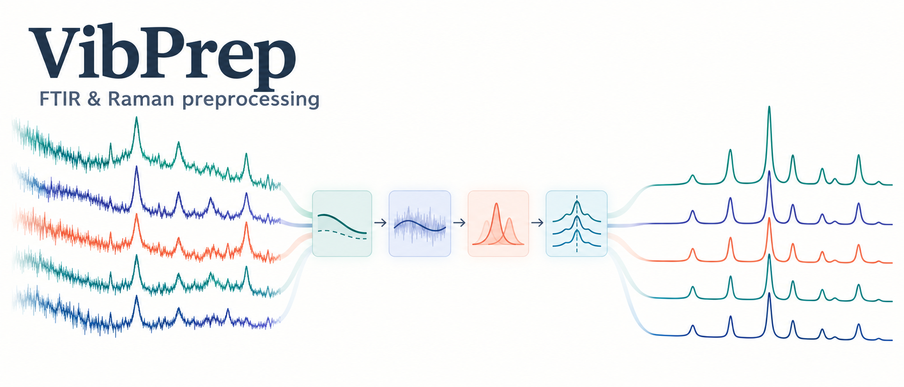

# VibPrep

**VibPrep** (*Vibrational spectroscopy Preprocessing*) is a modular Python library for preprocessing **FTIR** and **Raman** spectra.

It provides simple, NumPy-based building blocks (baseline correction, scatter correction, smoothing, derivatives, normalization, region selection and replicate averaging) and a configurable **pipeline** that chains them together reproducibly. It also includes a **configuration generator** to systematically explore many preprocessing combinations, for example when benchmarking machine-learning models.

<!--
  README IMAGE
  Save your figure as docs/images/overview.png (or change the path below).
  Recommended width: 900–1200 px.
-->
<p align="center">
  
</p>

> 🚧 **Status: early development.** The API may still change between versions.

---

## Table of contents

- [Why VibPrep?](#why-vibprep)
- [Installation](#installation)
- [Input data format](#input-data-format)
- [Quick start](#quick-start)
- [Preprocessing steps explained](#preprocessing-steps-explained)
  - [1. Replicate averaging](#1-replicate-averaging)
  - [2. Spectral region selection (trimming)](#2-spectral-region-selection-trimming)
  - [3. Baseline correction](#3-baseline-correction)
  - [4. Scatter correction (SNV)](#4-scatter-correction-snv)
  - [5. Smoothing](#5-smoothing)
  - [6. Derivatives](#6-derivatives)
  - [7. Intensity normalization](#7-intensity-normalization)
- [The preprocessing pipeline](#the-preprocessing-pipeline)
- [Generating preprocessing configurations](#generating-preprocessing-configurations)
- [Using VibPrep with Raman spectra](#using-vibprep-with-raman-spectra)
- [Repository structure](#repository-structure)
- [Roadmap](#roadmap)
- [Contributing](#contributing)
- [Citation](#citation)
- [License](#license)

---

## Why VibPrep?

FTIR and Raman are both **vibrational spectroscopy** techniques: they probe the vibrations of chemical bonds in a sample, FTIR through infrared absorption and Raman through inelastic scattering of laser light. Although the physics differs, the raw spectra suffer from similar artefacts:

- **Baseline drifts** (sloping or curved backgrounds, fluorescence in Raman).
- **Scatter and path-length effects** that change overall intensity between samples.
- **High-frequency noise**.
- **Overlapping bands** that are hard to separate.

Because of this, the same family of preprocessing methods is used for both techniques. VibPrep collects these methods in one place with a consistent interface:

- Every function works on a **2D matrix** of spectra (one spectrum per row).
- Every step can be used **on its own** or inside a **pipeline**.
- Pipelines are defined by a plain **dictionary**, so they are easy to save, compare and reproduce.

---

## Installation

VibPrep requires **Python ≥ 3.9** and depends on `numpy`, `scipy`, `pandas` and `pybaselines`.

### Option A: Install directly from GitHub

```bash
pip install git+https://github.com/alexgaarciia/VibPrep.git
```

### Option B: Clone and install in development (editable) mode

This is the recommended option if you want to modify the code. Changes to the source files take effect immediately without reinstalling.

```bash
git clone https://github.com/alexgaarciia/VibPrep.git
cd VibPrep

# (optional but recommended) create a virtual environment
python -m venv .venv
source .venv/bin/activate        # Windows: .venv\Scripts\activate

pip install -e .
```

To also install the development tools (`pytest`, `black`, `ruff`):

```bash
pip install -e ".[dev]"
```

### Option C: Reproduce the exact tested environment

`requirements.txt` pins the exact versions the library was developed with (these versions require **Python ≥ 3.11**):

```bash
pip install -r requirements.txt
pip install -e .
```

### Check the installation

```python
import vibprep
print(vibprep.__version__)
```

---

## Input data format

All functions follow the same conventions:

| Object | Type | Shape | Description |
|---|---|---|---|
| `X` | `numpy.ndarray` | `(n_samples, n_features)` | Spectral intensity matrix. **Each row is one spectrum.** |
| `wavelengths` | `numpy.ndarray` | `(n_features,)` | Spectral axis: wavenumbers (FTIR) or Raman shift (Raman), in cm⁻¹. Must match the columns of `X`. |
| `metadata` | `pandas.DataFrame` | `(n_samples, n_columns)` | *(Optional)* Information about each spectrum (sample ID, patient, class, replicate…). Only needed for replicate averaging. |

Example of loading spectra from a CSV where the first columns are metadata and the rest are intensities with numeric column names:

```python
import numpy as np
import pandas as pd

df = pd.read_csv("spectra.csv")

metadata_cols = ["sample_id", "replicate", "label"]
metadata = df[metadata_cols]
spectral_df = df.drop(columns=metadata_cols)

X = spectral_df.to_numpy(dtype=float)
wavelengths = spectral_df.columns.astype(float).to_numpy()
```

> **Note:** many FTIR instruments export spectra in **descending** wavenumber order (4000 → 400 cm⁻¹). The pipeline automatically reorders them to ascending order. If you use the individual functions, it is recommended to sort the axis in ascending order yourself.

---

## Quick start

```python
from vibprep.pipeline import PreprocessingPipeline

config = {
    "average": True,                 # average replicate spectra
    "region": "fingerprint",         # keep 900–1800 cm⁻¹
    "steps": [
        ("baseline", "als"),         # asymmetric least squares baseline
        ("scatter", "snv"),          # standard normal variate
        ("smoothing", "savitzky_golay"),
        ("derivative", 2),           # second derivative
        ("normalization", "l2"),
    ],
}

pipeline = PreprocessingPipeline(config)

X_proc, wn_proc, meta_proc = pipeline.transform(
    X,
    wavelengths,
    metadata=metadata,
    groupby_cols="sample_id",        # spectra with the same sample_id are averaged
)
```

You can also use each step on its own:

```python
from vibprep.baseline import als_baseline_correction
from vibprep.scatter import standard_normal_variate

X_corr, baseline = als_baseline_correction(X, lam=1e5, p=0.01)
X_snv = standard_normal_variate(X_corr)
```

---

## Preprocessing steps explained

This section explains **what** each step does, **why** it is useful and **when** to use it.

### 1. Replicate averaging

**Module:** `vibprep.replicates` · **Function:** `average_replicates(X, metadata, groupby_cols, method="mean")`

It is common to acquire several spectra of the same sample (technical replicates). Averaging them reduces random noise and gives a single representative spectrum per sample. It also prevents **data leakage** in machine learning, since replicates of the same sample cannot end up in both the training and the test set.

- `groupby_cols`: metadata column(s) that identify a replicate group. Spectra that share the same values in these columns are combined.
- `method`: `"mean"` (default) or `"median"`. The median is more robust to outlier spectra.

The returned metadata keeps the **first row** of each group.

```python
from vibprep.replicates import average_replicates

X_avg, meta_avg = average_replicates(X, metadata, groupby_cols=["patient", "sample_id"])
```

### 2. Spectral region selection (trimming)

**Module:** `vibprep.trimmer` · **Function:** `trim_spectral_region(data, wavelength, region)`

Not every part of the spectrum contains useful information. Selecting a region removes noisy or uninformative areas (e.g. CO₂ or water bands) and focuses the analysis on the biochemical information of interest.

Predefined regions (FTIR, in cm⁻¹):

| Region | Range (cm⁻¹) | Main biochemical content |
|---|---|---|
| `"full"` | whole spectrum | No trimming |
| `"fingerprint"` | 900 – 1800 | Proteins, lipids, nucleic acids, carbohydrates. The most information-rich region of biological samples |
| `"amide"` | 1500 – 1700 | Amide I (~1650) and Amide II (~1545) bands: protein content and secondary structure |
| `"lipid"` | 2800 – 3000 | CH₂ and CH₃ stretching vibrations of lipid chains |
| `"nucleic"` | 1000 – 1250 | Phosphate (PO₂⁻) vibrations of DNA/RNA |
| `"polysaccharide"` | 900 – 1200 | C–O and C–C vibrations of carbohydrates |

You can also pass a **custom interval** as a tuple `(min, max)`:

```python
from vibprep.trimmer import trim_spectral_region

X_fp, wn_fp = trim_spectral_region(X, wavelengths, "fingerprint")
X_custom, wn_custom = trim_spectral_region(X, wavelengths, (600, 1700))
```

### 3. Baseline correction

**Module:** `vibprep.baseline`

The baseline is a slowly varying background added to the real signal. It is caused by scattering, instrument drift, sample thickness or, in Raman, **fluorescence**. Removing it makes spectra comparable and lets peak intensities reflect the actual chemistry.

All baseline functions return **two arrays**: the corrected spectra and the estimated baseline (useful for plotting and checking the fit).

| Method | Function | How it works | When to use it |
|---|---|---|---|
| **Polynomial** | `polynomial_baseline_correction(data, wavelength, degree=2)` | Fits a polynomial of degree `degree` to the whole spectrum and subtracts it. | Simple, smooth baselines (linear or slightly curved). Fast. It can distort spectra with large peaks, because the peaks also influence the fit. |
| **AsLS** (Asymmetric Least Squares) | `als_baseline_correction(data, lam=1e5, p=0.01, niter=10)` | Fits a smooth curve that is penalized much more for being *above* the signal than below it, so it follows the bottom of the spectrum and ignores peaks. | The standard choice for FTIR and Raman. Works well with curved baselines and fluorescence. |
| **asPLS** (Adaptive Smoothness Penalized Least Squares) | `aspls_baseline_correction(data, lam=1e5, max_iter=10)` | A refinement of AsLS that adapts the penalty locally along the spectrum. | Baselines with changing curvature or spectra with broad peaks, where AsLS under- or over-corrects. |

Key parameters:

- `lam` (λ): **smoothness** of the baseline. Larger values → stiffer, smoother baseline. Typical range: `1e3` – `1e7`.
- `p`: **asymmetry** (AsLS only). Smaller values push the baseline further below the peaks. Typical range: `0.001` – `0.05`.
- `degree`: polynomial degree. Higher degrees follow more complex shapes but risk fitting the peaks themselves.

AsLS and asPLS are implemented with [`pybaselines`](https://github.com/derb12/pybaselines).

### 4. Scatter correction (SNV)

**Module:** `vibprep.scatter` · **Function:** `standard_normal_variate(data)`

Differences in sample thickness, density, particle size or focus change the **overall intensity** of a spectrum without changing its chemistry. The **Standard Normal Variate (SNV)** removes these effects by centring and scaling each spectrum independently:

$$x_{\text{SNV}} = \frac{x - \bar{x}}{\sigma_x}$$

After SNV every spectrum has mean 0 and standard deviation 1, so spectra can be compared by their *shape* rather than their absolute intensity.

### 5. Smoothing

**Module:** `vibprep.smoothing`

Smoothing reduces high-frequency noise. Too much smoothing, however, broadens peaks and can erase small but meaningful features.

| Method | Function | How it works | Notes |
|---|---|---|---|
| **Savitzky–Golay** | `savgol_smoothing(data, window_length=11, polyorder=2)` | Fits a low-degree polynomial in a sliding window and takes the value at its centre. | Preserves peak height and width better than a simple average. Usually the preferred option. |
| **Moving average** | `moving_average_smoothing(data, window_size)` | Replaces each point by the mean of its neighbours. | Simple and strong, but broadens peaks more. |

- `window_length` must be an **odd** integer and greater than `polyorder`.
- Larger windows → stronger smoothing.

### 6. Derivatives

**Module:** `vibprep.derivatives` · **Function:** `savgol_derivative(data, window_length=11, polyorder=2, deriv=1, delta=1.0)`

Derivatives are widely used in vibrational spectroscopy because they:

- **Remove baseline effects**: the 1st derivative removes constant offsets and the 2nd derivative also removes linear slopes.
- **Resolve overlapping bands**: the 2nd derivative turns each peak into a sharp negative minimum at the peak position, so shoulders become visible.
- **Highlight subtle differences** between spectra.

The derivative is computed with the Savitzky–Golay filter, which smooths and differentiates at the same time (derivatives amplify noise, so smoothing is essential).

- `deriv`: order of the derivative (`1` or `2`).
- `delta`: spacing between points on the spectral axis. Set it to the real spacing (e.g. `abs(wn[1] - wn[0])`) to obtain derivatives in physical units. The pipeline does this automatically.

### 7. Intensity normalization

**Module:** `vibprep.normalization` · **Function:** `intensity_normalization(data, method)`

Normalization scales each spectrum so that spectra with different overall intensities become comparable.

| Method | Operation | Interpretation |
|---|---|---|
| `"none"` | no change | |
| `"area"` | divide by the sum of intensities | Every spectrum has the same total area. |
| `"l2"` | divide by the Euclidean norm | Every spectrum has unit length (vector normalization). Common before ML models. |
| `"max"` | divide by the maximum value | The most intense point of each spectrum becomes 1. |

> **Tip:** area and max normalization assume mostly positive spectra. After SNV or derivatives, where values can be negative or sum to ~0, `"l2"` is usually the safer choice.

---

## The preprocessing pipeline

**Module:** `vibprep.pipeline` · **Class:** `PreprocessingPipeline(config)`

The pipeline applies a sequence of steps defined by a configuration dictionary:

```python
config = {
    "average": bool,        # average replicates? (requires metadata + groupby_cols)
    "region": str | tuple,  # predefined region name or (min, max)
    "steps": [              # ordered list of (step_name, value)
        ("baseline", ...),
        ("scatter", ...),
        ("smoothing", ...),
        ("derivative", ...),
        ("normalization", ...),
    ],
}
```

### Execution order

`pipeline.transform(X, wavelengths, metadata=None, groupby_cols=None)` always runs:

1. **Sort** the spectral axis in ascending order.
2. **Average replicates** (if `average=True`).
3. **Trim** to the selected region.
4. Apply the **`steps`** in the order given in the list.

It returns `(X_processed, wavelengths_processed, metadata_processed)`.

### Available step values

| Step | Accepted values | Parameters used by the pipeline |
|---|---|---|
| `"baseline"` | `"none"`, `"polynomial"`, `"als"`, `"aspls"` | polynomial: `degree=2` · AsLS: `lam=1e5, p=0.01, niter=10` · asPLS: `lam=1e5, max_iter=10` |
| `"scatter"` | `"none"`, `"snv"` | – |
| `"smoothing"` | `"none"`, `"savitzky_golay"`, `"moving_average"` | SG: `window_length=11, polyorder=2` · MA: `window_size=5` |
| `"derivative"` | `"none"`, `1`, `2`, `"1+2"` | SG: `window_length=11, polyorder=2`, `delta` = real axis spacing |
| `"normalization"` | `"none"`, `"area"`, `"l2"`, `"max"` | – |

> **Note on `"1+2"`:** the 1st and 2nd derivatives are **concatenated** along the feature axis, so the output has `2 × n_features` columns while the returned `wavelengths` keeps its original length.

> **Custom parameters:** the pipeline uses the fixed parameters above. If you need different values (e.g. a different `lam`), call the individual functions directly.

---

## Generating preprocessing configurations

**Module:** `vibprep.configs_generator` · **Function:** `generate_preprocessing_configs(...)`

Choosing the "best" preprocessing is often empirical. This function builds the **Cartesian product** of all options and returns a list of configuration dictionaries ready to feed into `PreprocessingPipeline`:

```python
from vibprep.configs_generator import generate_preprocessing_configs
from vibprep.pipeline import PreprocessingPipeline

configs = generate_preprocessing_configs(
    average_options=(True,),
    regions=("fingerprint", "amide"),
    baseline_options=("none", "als"),
    scatter_options=("snv",),
    smoothing_options=("savitzky_golay",),
    derivative_options=("none", 2),
    normalization_options=("l2",),
)

print(len(configs))  # 1 × 2 × 2 × 1 × 1 × 2 × 1 = 8

for cfg in configs:
    X_p, wn_p, meta_p = PreprocessingPipeline(cfg).transform(
        X, wavelengths, metadata, groupby_cols="sample_id"
    )
    # ... train / evaluate your model here ...
```

Each dictionary also stores every option under its own key (`"baseline"`, `"scatter"`, …), which makes it easy to turn the results into a table (`pd.DataFrame(configs)`) and compare them.

> With all the default options the generator produces **3,840 configurations**. Restrict the options to what is relevant for your study.

---

## Using VibPrep with Raman spectra

All the processing steps (baseline, SNV, smoothing, derivatives, normalization, averaging) work for Raman exactly as for FTIR: just use the **Raman shift** (cm⁻¹) as `wavelengths`.

The only difference is **region selection**. The predefined regions are **FTIR (infrared) bands**, and Raman bands of the same molecules appear at different positions. For Raman, pass a custom interval:

```python
config = {
    "average": False,
    "region": (400, 1800),          # typical Raman fingerprint region
    "steps": [
        ("baseline", "aspls"),      # handles fluorescence backgrounds well
        ("smoothing", "savitzky_golay"),
        ("scatter", "snv"),
    ],
}
```

Useful Raman ranges for biological samples (approximate):

| Range (cm⁻¹) | Content |
|---|---|
| 400 – 1800 | Raman fingerprint region |
| ~785 | Nucleic acids (ring breathing of pyrimidines) |
| ~1003 | Phenylalanine (sharp, often used as reference) |
| 1200 – 1300 | Amide III |
| ~1450 | CH₂ deformation (lipids and proteins) |
| 1600 – 1700 | Amide I |
| 2800 – 3050 | CH stretching (lipids, proteins) |

---

## Repository structure

```
VibPrep/
├── src/
│   └── vibprep/
│       ├── __init__.py
│       ├── replicates.py          # replicate averaging
│       ├── trimmer.py             # spectral region selection
│       ├── baseline.py            # polynomial, AsLS, asPLS baseline correction
│       ├── scatter.py             # SNV
│       ├── smoothing.py           # Savitzky–Golay, moving average
│       ├── derivatives.py         # Savitzky–Golay derivatives
│       ├── normalization.py       # area, L2, max normalization
│       ├── pipeline.py            # PreprocessingPipeline
│       └── configs_generator.py   # grid of preprocessing configurations
├── docs/
│   └── images/                    # figures used in this README
├── pyproject.toml
├── requirements.txt
├── LICENSE
└── README.md
```

---

## Roadmap

- [ ] Unit tests
- [ ] Custom parameters for each step inside the pipeline
- [ ] Predefined Raman regions
- [ ] Additional methods (e.g. MSC, EMSC, rubberband baseline)
- [ ] Plotting utilities
- [ ] Publication on PyPI

---

## Contributing

Contributions, bug reports and suggestions are welcome. Please open an [issue](https://github.com/alexgaarciia/VibPrep/issues) or a pull request.

For development:

```bash
pip install -e ".[dev]"
ruff check src
black src
pytest
```

---

## Citation

If you use VibPrep in your research, please cite it:

```bibtex
@software{garcia_navarro_vibprep,
  author  = {García Navarro, Alejandro Leonardo},
  title   = {VibPrep: modular preprocessing for vibrational spectroscopy},
  year    = {2026},
  url     = {https://github.com/alexgaarciia/VibPrep}
}
```

---

## License

This project is licensed under the **MIT License**. See [LICENSE](LICENSE) for details.
